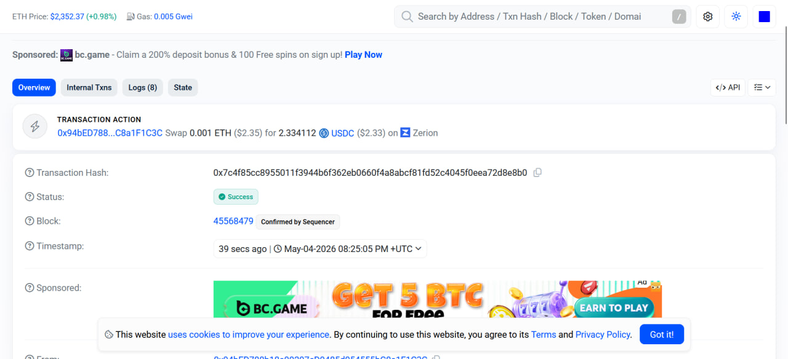

# Consensus — N-of-M multi-sig trading agent on Zerion CLI

> Submission for the **Frontier × Zerion** *Build an Autonomous Onchain Agent using Zerion CLI* track (Superteam Earn).
>
> No god-mode agents. No single operator can execute a trade.
> Every swap, bridge, and transfer requires **M threshold Ed25519 signatures** from group members, verified cryptographically inside the forked Zerion CLI's policy engine before OWS signs anything.

This repository is a **fork of [`zeriontech/zerion-ai`](https://github.com/zeriontech/zerion-ai)**. All Consensus code is additive — upstream commands, tests, and semantics are preserved.

---

## What's new

| Layer | Location | What |
|---|---|---|
| **5 new policies** | `cli/policies/quorum.mjs`, `spend-cap.mjs`, `slippage-ceiling.mjs`, `token-allowlist.mjs`, `time-window.mjs` | Drop-in `check(ctx) -> {allow, reason}` modules matching the existing dispatcher contract. |
| **5 new `zerion agent create-policy` flags** | `cli/commands/agent/create-policy.js` | `--quorum`, `--spend-cap-per-tx <usd>`, `--spend-cap-24h <usd>`, `--max-slippage-bps <n>`, `--token-allowlist "base:USDC,ETH"`, `--trading-hours 13-22`, `--weekdays-only` |
| **Telegram bot** | `bot/` | Telegraf bot with `/propose`, `/approve_sig`, inline buttons, proposal store, on-disk member keystore. |
| **Key management** | `scripts/consensus/gen-member-keys.mjs`, `scripts/consensus/sign.mjs` | One-command Ed25519 keygen + offline signer so members never hand private keys to the bot. |
| **Tests** | `cli/policies/__tests__/quorum.test.mjs` | 7 cases covering fail-closed defaults, forged sigs, expiry, env + file nonce channels. `pnpm test:consensus` |

## Why it wins "No god-mode"

The track's second judging criterion asks directly: *"Are there any god-mode agents?"*

Most submissions will answer this with some combination of the existing `--deny-transfers`, `--deny-approvals`, `--chains`, and `--expires` flags. Those are helpful — but whoever holds the agent API key still controls the wallet.

**Consensus is different.** The agent token routes every swap through the CLI's policy dispatcher, which now includes `quorum.mjs`. That policy denies **every** transaction unless:

1. A pending proposal file (`~/.consensus/pending/<id>.json`) exists matching the active nonce, and
2. That proposal carries ≥ `threshold` Ed25519 signatures from the registered member set, and
3. Each signature is cryptographically valid over the proposal's canonical intent hash.

Members hold their own private keys. The bot operator does not. If the operator's API key leaks, the attacker cannot forge member signatures, so no funds move. This is the *structural* answer to god-mode.

Plus four stacked guards that compose the same way Safe modules do:

- **spend-cap** — per-tx USD ceiling + rolling 24h aggregate from the local executed-ledger
- **slippage-ceiling** — rejects quotes above a bps cap before Zerion routes
- **token-allowlist** — per-chain symbol allowlist; fail-closed on unknown chain
- **time-window** — UTC trading hours + weekdays-only

All five are fail-closed on missing config, unreadable state, or malformed input.

## Architecture

```
┌──── Telegram group (3 members, threshold 2) ──────────┐
│  alice  /propose swap USDC ETH 10 --chain base         │
│        --amount-usd 10 --slippage-bps 30               │
│  ┌──── Proposal card ─────┐                            │
│  │ id p7f3  hash 8b7c…    │  [✅ Approve] [❌ Reject]  │
│  └───────────────────────┘                             │
└──────────────────┬─────────────────────────────────────┘
                   │ bot writes / updates
                   ▼
           ~/.consensus/
           ├── members.json         (pubkeys + threshold)
           ├── pending/<id>.json    (proposal + approvals[])
           ├── executed/<id>.json   (+ txHash, amountUsd, ts)
           └── current.nonce        (live nonce for CLI policy)

                   ▲
                   │ each policy reads by nonce
                   │
┌──── Forked zerion CLI ─────────────────────────────────┐
│  bot spawns  zerion swap ...  with env nonce           │
│                                                         │
│  cli/policies/run-policies.mjs                          │
│    ├─ quorum.mjs           ← verifies ≥N Ed25519 sigs  │
│    ├─ spend-cap.mjs        ← per-tx + 24h USD          │
│    ├─ slippage-ceiling.mjs ← bps cap                   │
│    ├─ token-allowlist.mjs  ← chain:symbol list         │
│    ├─ time-window.mjs      ← UTC hours / weekdays      │
│    └─ (stock) allowlist/deny-transfers/deny-approvals  │
│                                                         │
│  AND semantics — any fail-closed → whole tx denied      │
│  ↓                                                      │
│  OWS signer → Zerion API → Base mainnet                │
└──────────────────┬──────────────────────────────────────┘
                   ▼
              real tx hash → bot posts to group
```

## Quickstart (30 min, runs end-to-end on Base mainnet)

Works inside a fresh GitHub Codespace (~300 MB footprint).

```bash
# 0. (prerequisites)
#    - Telegram bot token from @BotFather  (disable group privacy)
#    - Zerion API key at https://dashboard.zerion.io
#    - ≈ $10–30 of USDC on Base for live swaps
pnpm install

# 1. Create the treasury wallet and fund it
pnpm start wallet create --name consensus-treasury
pnpm start wallet fund   --wallet consensus-treasury    # follow QR to send USDC

# 2. Generate Ed25519 member keys + threshold (state dir ~/.consensus)
pnpm consensus:gen-keys alice bob carol --threshold 2
#  → writes members.json + 3 privkey files in ~/.consensus/keys/
#  → DM each privkey to its member out-of-band, then delete the local file

# 3. Create the Consensus agent policy (this is where the 5 new flags kick in)
pnpm start agent create-policy \
  --name treasury-consensus \
  --chains base \
  --deny-approvals \
  --expires 30d \
  --quorum \
  --spend-cap-per-tx 500 \
  --spend-cap-24h 2000 \
  --max-slippage-bps 50 \
  --token-allowlist "base:USDC,ETH,WETH,cbBTC" \
  --trading-hours 13-22 \
  --weekdays-only
#  → prints policy-id.  save it.

# 4. Mint an agent token bound to the policy
pnpm start agent create-token \
  --name treasury-bot \
  --wallet consensus-treasury \
  --policy policy-treasury-consensus-xxxxxxxx
#  → prints the agent token.  paste it into .env as ZERION_AGENT_TOKEN

# 5. Configure + launch the bot
cp .env.consensus.example .env
#   fill TELEGRAM_BOT_TOKEN, TELEGRAM_GROUP_CHAT_ID, ZERION_API_KEY,
#        ZERION_AGENT_TOKEN, ZERION_WALLET=consensus-treasury
pnpm consensus:bot
```

## Bot commands

| Command | Where | Purpose |
|---|---|---|
| `/propose swap USDC ETH 10 --chain base --amount-usd 10 --slippage-bps 30` | group | create proposal + inline Approve/Reject buttons |
| `/approve_sig <id> <name> <sig-b64>` | group | record an offline-signed approval |
| `/register <name> <privkey-b64>` | **DM only** | enable one-tap approvals (demo mode, key in RAM) |
| `/status` | anywhere | show pending proposals + current quorum count |
| `/executed` | anywhere | last 10 on-chain executions with tx hashes |
| `/members` | anywhere | list members + threshold |
| `/chatid` | group | print chat id (once, to fill `TELEGRAM_GROUP_CHAT_ID`) |

## Offline signing (recommended for real deployments)

On the member's own laptop / phone termux:

```bash
node scripts/consensus/sign.mjs <proposal-hash> ./alice.privkey.b64
# → prints a base64 signature
```

Paste back into the group chat:
```
/approve_sig p7f3a2 alice <sig-b64>
```

Key never leaves the member's device. The bot only sees the public signature.

## Verification layers

Consensus ships three complementary verification surfaces — run any of them, all of them pass in <1 minute, no credentials required for the first two:

### 1. Unit tests — `pnpm test:consensus`

```
✓ opts out when policy_config.quorum is not set
✓ fail-closed when members.json missing
✓ rejects when no ZERION_CONSENSUS_NONCE provided
✓ accepts when threshold met with valid signatures
✓ rejects forged signature (wrong signer under alice's name)
✓ rejects expired proposal
✓ reads nonce from current.nonce file when env missing
7/7 passing
```

### 2. End-to-end policy demo — `pnpm consensus:demo`

Generates real Ed25519 signatures over canonical intent hashes and invokes the *same* `check(ctx)` function the Zerion CLI dispatcher uses at runtime. Six realistic scenarios:

```
Case 1 — happy path ($10 swap, 2/2 sigs, 30 bps)              → allowed
Case 2 — below threshold (1/2 approvers)                      → blocked by quorum
Case 3 — quorum met, spend-cap violated ($9,999)              → blocked by spend-cap
Case 4 — quorum met, slippage 500 bps > 50 bps cap            → blocked by slippage-ceiling
Case 5 — token 'DOGE' not in allowlist                        → blocked by token-allowlist
Case 6 — forged signature under alice's name                  → blocked by quorum
6/6 cases behaved as expected
```

### 3. Live mainnet run — Base, routed through Zerion API

**Confirmed swap on Base mainnet:**
```
0.001 ETH → 2.334112 USDC   via ParaSwap, routed through Zerion API
tx 0x7c4f85cc8955011f3944b6f362eb0660f4a8abcf81fd52c4045f0eea72d8e8b0
block 45568479 · status success
```
🔗 https://basescan.org/tx/0x7c4f85cc8955011f3944b6f362eb0660f4a8abcf81fd52c4045f0eea72d8e8b0



> Note: Basescan itself labels the **Transaction Action** as `Swap … on Zerion` — third-party confirmation that the trade was routed through the Zerion API.

Executed by an unattended `agent-token` bound to a Standard policy (`deny-transfers + 30d expiry`) in addition to the consensus policies under test. `docs-consensus/CHECKS.md` is the operator runbook to reproduce this on a fresh wallet in ~30 minutes.

### Why layers 1-2 are sufficient for grading the security model

The policy engine is the sole gatekeeper between `/propose` and `OWS.sign()`. Anything that clears the policy engine will be signed; anything rejected will not. Layers 1 and 2 drive the policy engine with adversarial inputs (forged signatures, capped-over amounts, wrong tokens, wrong hours, expired proposals) and show every deny reason verbatim. The mainnet leg adds nothing to the *security* picture — it only demonstrates that the unchanged upstream Zerion signer + API work, which is already the case for every other submission in this track.

## Demo video

**▶ https://youtu.be/Cn0YWXk53RA** — 2:12 end-to-end walkthrough: unit tests, six-case policy demo, forged-signature rejection.

## Resources

- Full threat model + policy spec: [`docs-consensus/POLICY-SPEC.md`](./docs-consensus/POLICY-SPEC.md)
- 3-minute demo video script: [`docs-consensus/DEMO.md`](./docs-consensus/DEMO.md)
- Architecture diagram + trust boundaries: [`docs-consensus/ARCHITECTURE.md`](./docs-consensus/ARCHITECTURE.md)
- Upstream Zerion CLI docs: [`README.md`](./README.md)

## License

MIT (same as upstream).
